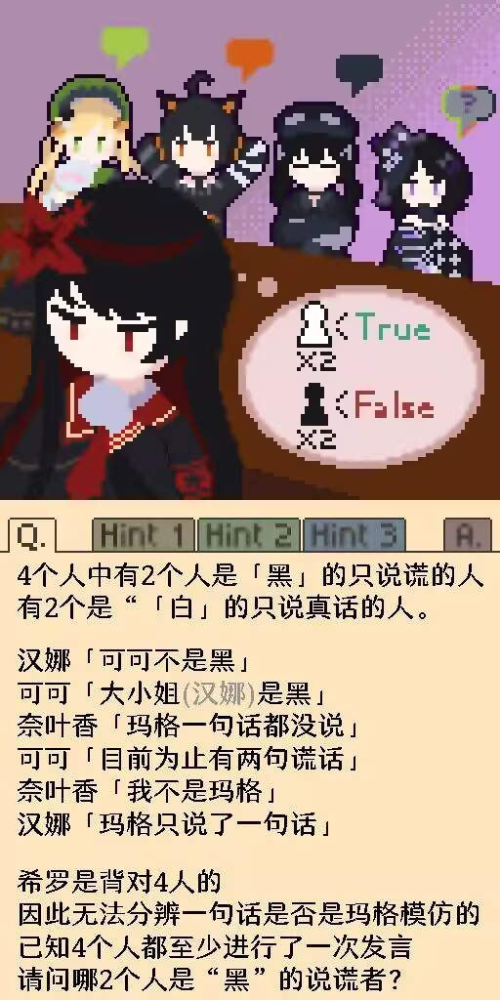

## 一个 QQ 群中的题目



直接枚举就好了，实现的过程还是挺有意思的，用到了一些不太常用的语法，以及一些子集枚举技巧。

```cpp
#include <iostream>
using namespace std;

enum {
    Hanna, Koko, Nanoka, Maago
};

const char* name[4] = {"Hanna", "Koko", "Nanoka", "Maago"};

int speaker[6] = {Hanna, Koko, Nanoka, Koko, Nanoka, Hanna};
bool res[6];
const bool (*statement[6])() = {
    []() -> const bool {
        for (int i = 0; i < 6; i++) {
            if (speaker[i] == Koko && res[i] == false) return false;
        }
        return true;
    },
    []() -> const bool {
        for (int i = 0; i < 6; i++) {
            if (speaker[i] == Hanna && res[i] == true) return false;
        }
        return true;
    },
    []() -> const bool {
        for (int i = 0; i < 6; i++) {
            if (speaker[i] == Maago) return false;
        }
        return true;
    },
    []() -> const bool {
        int cnt = 0;
        for (int i = 0; i < 4; i++) {
            cnt += !res[i];
        }
        return cnt == 2;
    },
    []() -> const bool {
        return speaker[4] != Maago;
    },
    []() -> const bool {
        int cnt = 0;
        for (int i = 0; i < 6; i++) {
            cnt += (speaker[i] == Maago);
        }
        return cnt == 1;
    }
};

void dfs(int now)
{
    if (now == 6) {
        int cnt[4] = {0};
        for (int i = 0; i < 6; i++) cnt[speaker[i]]++;
        for (int i = 0; i < 4; i++) if (!cnt[i]) return;

        auto next_st = [](int st) {
            int lb = st & -st;
            return (st + lb) | ((st ^ (st + lb)) / lb >> 2);
        };
        for (int st = 0b0011; st < (1 << 4); st = next_st(st)) {
            for (int i = 0; i < 6; i++) {
                res[i] = ((st >> speaker[i]) & 1);
            }
            auto check = []() {
                for (int i = 0; i < 6; i++) {
                    if (statement[i]() != res[i]) return false;
                }
                return true;
            };
            if (check()) {
                cout << "Speaker: ";
                for (int i = 0; i < 6; i++) {
                    cout << name[speaker[i]] << ' ';
                }
                cout << endl;
                for (int i = 0; i < 4; i++) {
                    cout << name[i] << ": " << (((st >> i) & 1) ? "True" : "False") << endl;
                }
            }
        }
        return;
    }

    dfs(now + 1);
    int t = speaker[now];
    speaker[now] = Maago;
    dfs(now + 1);
    speaker[now] = t;

    return;
}

int main()
{
    dfs(0);

    return 0;
}
```